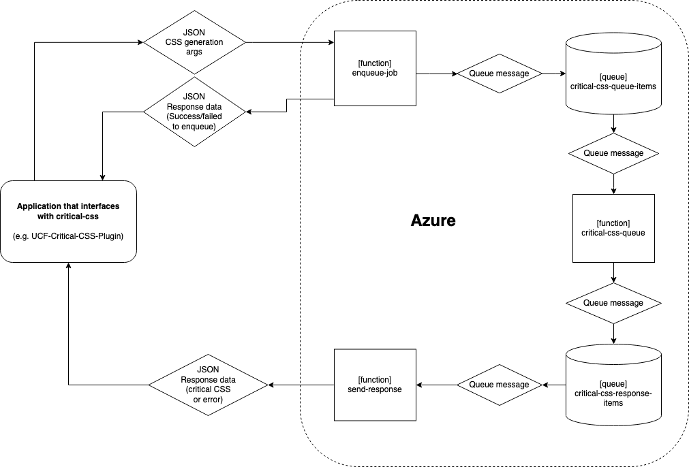

# Critical CSS - Azure Functions

This project provides an Azure Function App for processing provided HTML and returning the Critical CSS needed to render the above the fold content at various dimensions. The code is specifically designed to work with and be deployed to [Azure Functions](https://azure.microsoft.com/en-us/services/functions/).


## Requirements

* NodeJS 14+
* VSCode (Deployment Configs are built for VSCode)


## Getting Started

1. Ensure VSCode is installed. The project can be modified and deployed without VSCode, but all the following instructions will assume VSCode is being used.
2. Install the Azure Functions Core Tools:
    - Open a terminal/command prompt
    - If using `nvm`, ensure you're using version 14+ of nodejs: `nvm use 14`
    - Install globally: `npm install -g azure-functions-core-tools@3 --unsafe-perm true`
3. Install recommended VSCode extensions:
    - [Azure Functions](https://marketplace.visualstudio.com/items?itemName=ms-azuretools.vscode-azurefunctions) - For deployment and testing
    - [Azurite](https://marketplace.visualstudio.com/items?itemName=Azurite.azurite) - For Queue testing
4. Install npm dependencies:
    - Open a new terminal
    - If using `nvm`, ensure you're using version 14+ of nodejs: `nvm use 14`
    - Install local dependencies: `npm install`
5. Copy the `local.settings.templ.json` file and rename it `local.settings.json`.
6. Set up Azure Functions in VSCode:
    - Click on the Azure Functions tab
    - Log into Azure account
    - Open local project and browse to the directory of this project
7. If not already created, go to the [Azure Portal](https://portal.azure.com) and create a new Function App to deploy to. Alternatively, you can deploy to a new Function App by following the prompts in Visual Studio Code when deploying the function.
8. (Optional) For testing and debugging Queue triggered functions, it is recommended you install [Microsoft Azure Storage Explorer](https://azure.microsoft.com/en-us/features/storage-explorer/) for adding items to a local Queue.
9. (Optional) In order to connect to the local Queue, you must have the local storage path defined in your `local.settings.json` file as follows (note the account name and password is the default for all local storage emulation):
```
{
    "IsEncrypted": false,
    "Values": {
        "FUNCTIONS_WORKER_RUNTIME": "node",
        "AzureWebJobsStorage": "DefaultEndpointsProtocol=http;AccountName=devstoreaccount1;AccountKey=Eby8vdM02xNOcqFlqUwJPLlmEtlCDXJ1OUzFT50uSRZ6IFsuFq2UVErCz4I6tq/K1SZFPTOtr/KBHBeksoGMGw==;QueueEndpoint=http://127.0.0.1:10001/devstoreaccount1;",
    }
}
```


## Project Overview

This project consists of multiple functions that relay critical CSS data through a queueing system.  The general flow of data is outlined in the diagram below:



### Making Requests

An application interfacing with this app should request critical CSS generation via a POST request containing JSON with settings for generating the critical CSS; see [sample data](https://github.com/UCF/critical-css/tree/main/enqueue-job) for expected arguments.  The app will return a success or error message back in plaintext.

### Getting Data

When critical CSS generation is finished, the app will send a POST to the URL provided in the initial request's `meta.response_url` value, containing the generated critical CSS or an error message.
